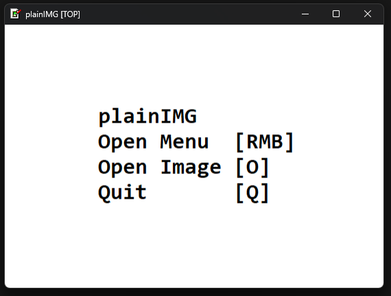
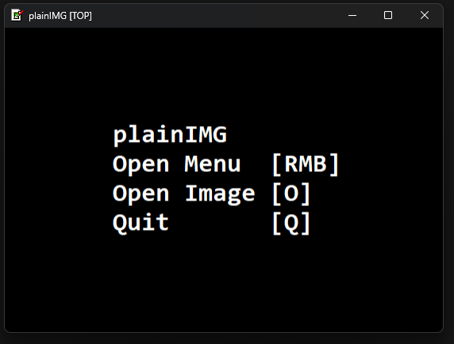
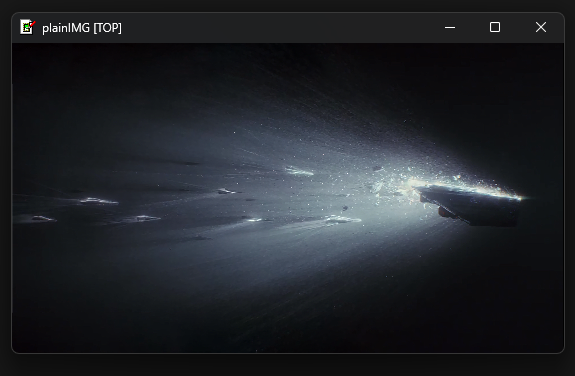
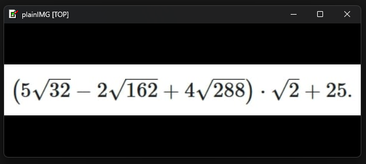
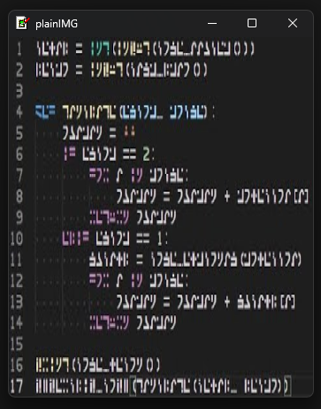
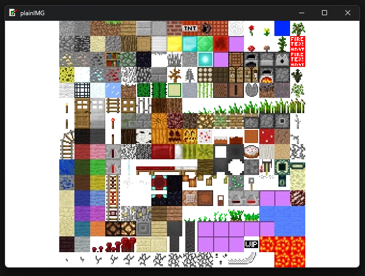
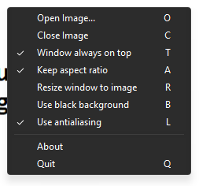
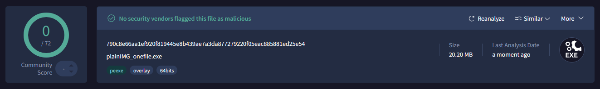

# [plainIMG2](https://github.com/qaptivator/plainimg2)

_///// as simple as it gets for an image viewer /////_

# usage

- install the executable from the latest release (as of now, just clone the repository)
- run it by using the context menu button in an image (may require you to click "show more")
  - or by dragging a picture over the executable
  - or by running the executable and opening the picture with `Right Click > Open Image...` (or just letter `O`)
  - or by running it through the terminal with first argument being the file path

the main menu is opened with `Right Click`.
you can close the window with `Right Click > Quit` or just `Q`, or just `ESCAPE`.
to make the window be the size of the image, press `R`.
to make the window be over other windows and also dont go behind other windows when unfocused, press `T`. _this is enabled by default._  
to see the rest of the features, look down below.  
to support the developer, you can appreciate the project by giving it a star in the GitHub repository. thanks!

# all of the features

- open an image using in-app file selector with `O`,
  - or give it the image path as first argument,
  - or as a hidden windows feature, drag an image over the executable and it will consider it as the first cli argument.
- close an image with `C`, which puts you back into the starting menu.
- open actions menu with `Right Click`, which shows all of the actions which you can do and their corresponding hotkeys.
- make the windows stay on top of other windows using `T`. this basically pins the window, and it wont disappear when you unfocus out of the window. enabled by default.
- use a black background instead of white one with `B`. useful for png files. disabled by default.
- keep the aspect ratio of the image with `A`. if you disable this, it will stretch the picture across the entire window. enabled by default.
- resize the window to be the image's size with `R`. note: only works if keep aspect ratio is enabled.
- when working with small resolution images, antialiasing usually ruins the image, so disable it with `L`. antialiasing is enabled by default.
- the window is also draggable in client area (other than the title bar), but be aware that native windows functions like window snapping wont work here. they only work with the title bar provided by windows.
- quit the app by closing the window, pressing `Q` or `ESCAPE`.
- the link to this github repository is located inside the `About` menu.
- WARNING: as of now, this project is only available on Windows. if this project gets enough attention, i will make a version for macOS and possibly even Linux.

# screenshots

---

[VirusTotal check](https://www.virustotal.com/gui/file/790c8e66aa1ef920f819445e8b439ae7a3da877279220f05eac885881ed25e54/detection)

# introduction

sometimes, i just want to open an image, and pin it somewhere on my display.  
i can open images with other progrsms like built-in media app or some external one,  
but there is one thing i always encounter: **application window ui**

a lot of the times, the ui gets in the way of me just SEEING the image.  
so with this tool, i fixed just that!  
using this tool, you can view the image easily, because it covers the entire window!
so now, without any obtrusive ui, you can view your images.  
you can also make the window be always an top, so its actually usable (inspired by AlwayOnTop module in PowerToys).

at first, i made this in python, but pyinstaller executables were always flagged by antiviruses, so i decided to remake the project in C with SDL.
this not only makes the project not false flagged by antiviruses, but also more lightweight!  
this project is also my first, fully finished C project, which i am quite proud of.  
(the actual exe is under 1 MB! but the SDL3 dll is almost 5 MBs...)

licensed under MIT. credits to microsoft for the retro windows icon (icon.ico).

# build

- SDL3 is included inside this repository, so just clone this repository
- you need vs c/c++ redistributable and gcc installed
- run `./build.sh`, and it will build everything for you with gcc inside `build/debug`. run with `./build/debug/plainIMG.exe` (or `./build.sh -a` for short)
- if youre not statically building with `-s`, you NEED to have `SDL3.dll` and `SDL3_image.dll` located in the same directory as the executable.
- build the resoures (icon + welcome text) with `windres src/plainIMG.rc -O coff -o src/plainIMG_rc.o`

libraries used: [SDL 3](https://github.com/libsdl-org/SDL), [SDL3_image 3](https://github.com/libsdl-org/SDL_image/),

if you want to update SDL or SLD_Image, you would have to build static binaries (`*.a`) yourself.  
just clone the repositores, make a `build` folder, inside it run `cmake .. -DSDL_STATIC=ON` and `cmake --build .`.  
then, just copy over generated `.a` files to `lib/` folder of each library.

for SDL3_image, there is a special case. copy over the entire SDL folder, where you just built it inside `build/`,  
then run SDL3_image build with `cmake .. -DBUILD-SHARED-LIBS=OFF`, then do `cmake --build .`.
you would also need to use `git submodule update --init --recursive` in SDL image.

you need inno setup installed to build for release, and it should be in the PATH. to build for release, run `./release.sh <version>`. it will create `build/release`. then, after you made sure that all of the artifacts work, tag the release with `./tag_release.sh <version>`. push it with `git push origin tag <version>`, and then make your release in github. the versions should be in the format of "vX.X.X". **BE SURE TO MANUALLY UPDATE THE VERSION NUMBER IN INSTALLER.ISS BEFORE RUNNING RELEASE.SH**

# todo list

- [ ] save menu configurations to some text file, so that it will save between launches
- [ ] add a reminder when there is a new version of this app
- [ ] finish up lite mode
- [x] add icon to the executable with windres
- [ ] build this exe statically (basically you need to have .a's instead of .dll's) (SDL3_image doesnt want to build statically wth)
- [ ] make a lite mode where the title bar will be hidden, so you will be able to see just the picture
- [ ] make proper version control (possibly with an auto-updater)
- [x] make an inno setup installer
- [ ] fix the client area dragging being a bit choppy
