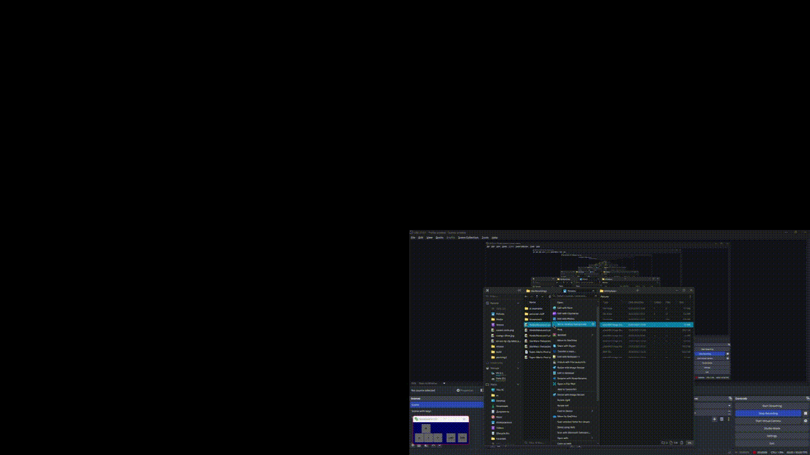

# [plainIMG2](https://github.com/qaptivator/plainimg2)

_///// as simple as it gets for an image viewer /////_

# why would i use this?

1. look at the comparison between plainIMG and Photos (opens images almost twice as fast!):



2. the image window is pinned on top of every other window by default (no need to install PowerToys or other software!):
3. lightweight (the executable is under 3MB!)

# usage

- **install the installer from the latest release. (`plainIMG_vN.N.N_installer.exe`)**
- run it and it will install the app, and also add plainIMG to start menu. if you click the "Set plainIMG as the default image viewer" option, jpg, jpeg, png and bmp file extensions will be associated with plainIMG.
- now that it is installed, you can open an image, select plainIMG and click "Always".
- alternatively, you can go to settings, default apps, and set common image formats to plainIMG.
- when you are done, you can use plainIMG by clicking on the image (or using "Choose an App on your PC")
  - or by running the executable and opening the picture with `Right Click > Open Image...` (or just letter `O`)
  - or by running it through the terminal with first argument being the file path
  - or by dragging a picture over the executable

the main menu is opened with `Right Click`.
you can close the window with `Right Click > Quit` or just `Q`, or just `ESCAPE`.
to make the window be the size of the image, press `R`.
to make the window be over other windows and also dont go behind other windows when unfocused, press `T`. _this is enabled by default._  
to see the rest of the features, look down below.  
to support the developer, you can appreciate the project by giving it a star in the GitHub repository. thanks!

# all of the features

- open an image using in-app file selector with `O`,
  - or give it the image path as first argument,
  - or as a hidden windows feature, drag an image over the executable and it will consider it as the first cli argument.
- close an image with `C`, which puts you back into the starting menu.
- open actions menu with `Right Click`, which shows all of the actions which you can do and their corresponding hotkeys.
- make the windows stay on top of other windows using `T`. this basically pins the window, and it wont disappear when you unfocus out of the window. enabled by default.
- use a black background instead of white one with `B`. useful for png files. disabled by default.
- keep the aspect ratio of the image with `A`. if you disable this, it will stretch the picture across the entire window. enabled by default.
- resize the window to be the image's size with `R`. note: only works if keep aspect ratio is enabled.
- when working with small resolution images, antialiasing usually ruins the image, so disable it with `L`. antialiasing is enabled by default.
- the window is also draggable in client area (other than the title bar), but be aware that native windows functions like window snapping wont work here. they only work with the title bar provided by windows.
- quit the app by closing the window, pressing `Q` or `ESCAPE`.
- the link to this github repository is located inside the `About` menu.
- WARNING: as of now, this project is only available on Windows. if this project gets enough attention, i will make a version for macOS and possibly even Linux.
- note: when you click the "Set plainIMG as the default image viewer" option in the installer, it automatically sets plainIMG as default for: .jpg, .jpeg, .png and .bmp; if you want to extend this list, update file extension defaults yourself in windows settings.
- TIFF, AVIF and WEBP are not supported.
- animated GIFs are not supported.
- your settings (keepAspectRatio useBlackBg useAntialiasing alwaysOnTop keepWindowAspectRatio showImageName) are stored inside `settings.txt`. i serialize these bools into string of 0's and 1's, where 0 is false, 1 is true. the order of those numbers matters here. the order was specified at the start of this point. anything other than 0 or 1 is considered a comment and just ignored.

# screenshots


---

[VirusTotal check](https://www.virustotal.com/gui/file/790c8e66aa1ef920f819445e8b439ae7a3da877279220f05eac885881ed25e54/detection)


# introduction

sometimes, i just want to open an image, and pin it somewhere on my display.  
i can open images with other progrsms like built-in media app or some external one,  
but there is one thing i always encounter: **application window ui**

a lot of the times, the ui gets in the way of me just SEEING the image.  
so with this tool, i fixed just that!  
using this tool, you can view the image easily, because it covers the entire window!
so now, without any obtrusive ui, you can view your images.  
you can also make the window be always an top, so its actually usable (inspired by AlwayOnTop module in PowerToys).

at first, i made this in python, but pyinstaller executables were always flagged by antiviruses, so i decided to remake the project in C with SDL.
this not only makes the project not false flagged by antiviruses, but also more lightweight!  
this project is also my first, fully finished C project, which i am quite proud of.  
(the actual exe is under 1 MB! but the SDL3 dll is almost 5 MBs...)

licensed under MIT. credits to microsoft for the retro windows icon (icon.ico).

# todo list

- [x] save menu configurations to some text file, so that it will save between launches
- [ ] add a reminder when there is a new version of this app
- [x] add icon to the executable with windres
- [x] build this exe statically (basically you need to have .a's instead of .dll's)
- [ ] make a lite mode where the title bar will be hidden, so you will be able to see just the picture
- [ ] make proper version control (possibly with an auto-updater)
- [x] make an inno setup installer
- [ ] fix the client area dragging being a bit choppy
- [x] add a global VERSION.txt file which will be used everywhere (main.c, installer.iss, tag_release.sh etc)
- [x] add the image basename when an image is opened to the window's title
- [ ] possibly make an .msi installer
- [x] make the app notify you if it couldnt open an image instead of just silencing it
- [ ] fix the fact that sometimes, when you resize window to image, it just doesnt properly resize, and it keeps on resizing
- [x] optimize the app so that it wont rerender every time, even though there are no changes
- [x] reduce the cpu usage spike when dragging or resizing the window
- [ ] add support for animated GIFs.
- [ ] add support for WEBP (probably never).

# build

- SDL3 is included inside this repository, so just clone this repository
- you need vs c/c++ redistributable and gcc installed
- run `./build.sh`, and it will build everything for you with gcc inside `build/debug`. run with `./build/debug/plainIMG.exe` (or `./build.sh -a` for short)
- if youre not statically building with `-s`, you NEED to have `SDL3.dll` and `SDL3_image.dll` located in the same directory as the executable.
- build the resoures (icon + welcome text) with `windres src/plainIMG.rc -O coff -o src/plainIMG_rc.o`

libraries used: [SDL 3](https://github.com/libsdl-org/SDL), [SDL3_image 3](https://github.com/libsdl-org/SDL_image/),

## build the installer

you need inno setup installed to build for release, and it should be in the PATH.  
when you want to build a new release, edit `VERSION.txt` with the version format being `vX.X.X`.  
to build all the things for release, run `./release.sh`. it will create `build/release`, where `build/release/upload` is the things you would need to upload to github release.  
mark your release with `./tag_release.sh`. it will automatically push it. **make sure that you correctly specify the version, and it's not a duplicate**

## build SDL3 and SDL_image manually

if you want to update SDL or SLD_Image, you would have to build static binaries (`*.a`) yourself.  

### build SDL3

```sh
git clone https://github.com/libsdl-org/SDL.git && cd SDL
mkdir build && cd build
cmake .. -DSDL_STATIC=ON
cmake --build .
```

after that it will make a `libSDL3.a`. copy it to `plainimg2/src/SLD3/lib`.

### build SDL_image

```sh
git clone https://github.com/libsdl-org/SDL_image.git && cd SDL_image
git clone https://github.com/libsdl-org/SDL.git # SDL_image requires SDL as a dependency
git submodule update --init --recursive
mkdir build && cd build
cmake .. -DBUILD-SHARED-LIBS=OFF
cmake --build .
```

after that it will make a `libSDL_image.a`. copy it to `plainimg2/src/SDL3_image/lib`.  
SDL_image will also give errors where certain libraries are not found.  
these libraries are required for other file formats like WebP to work.  
i tried building them myself statically but its just very painful to do.  
that is why im not planning on adding support to WebP, TIFF and other unsupported formats.
